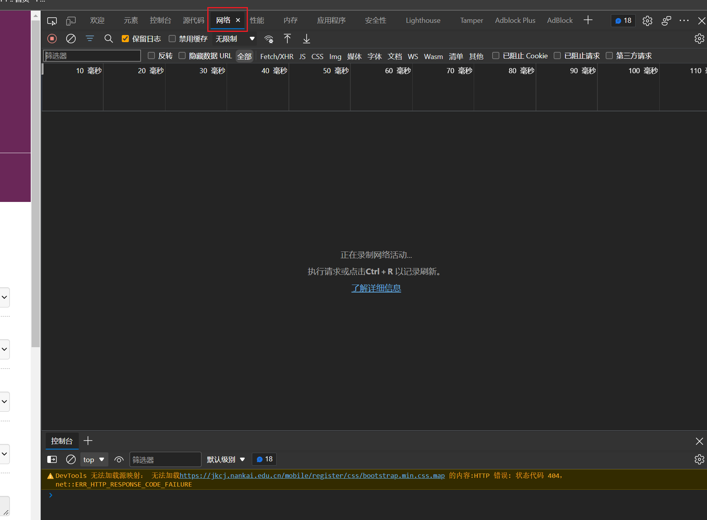
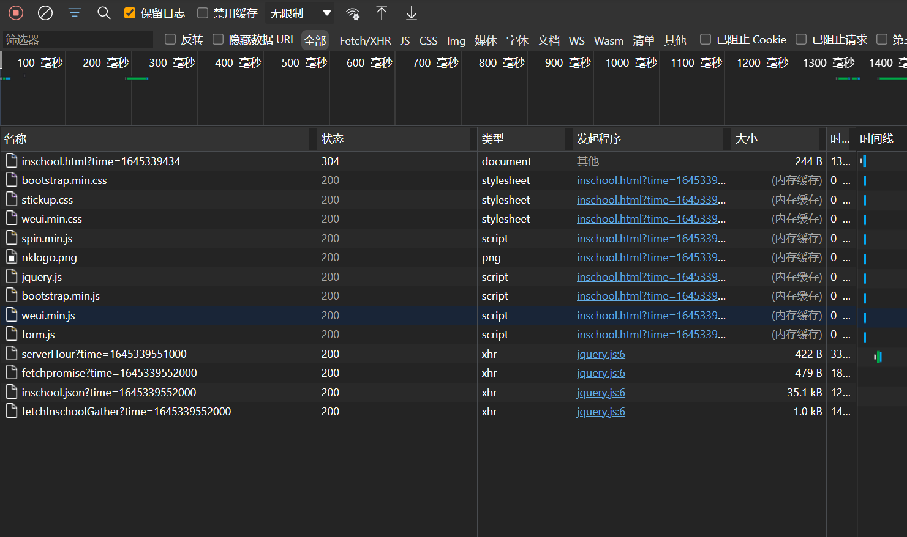
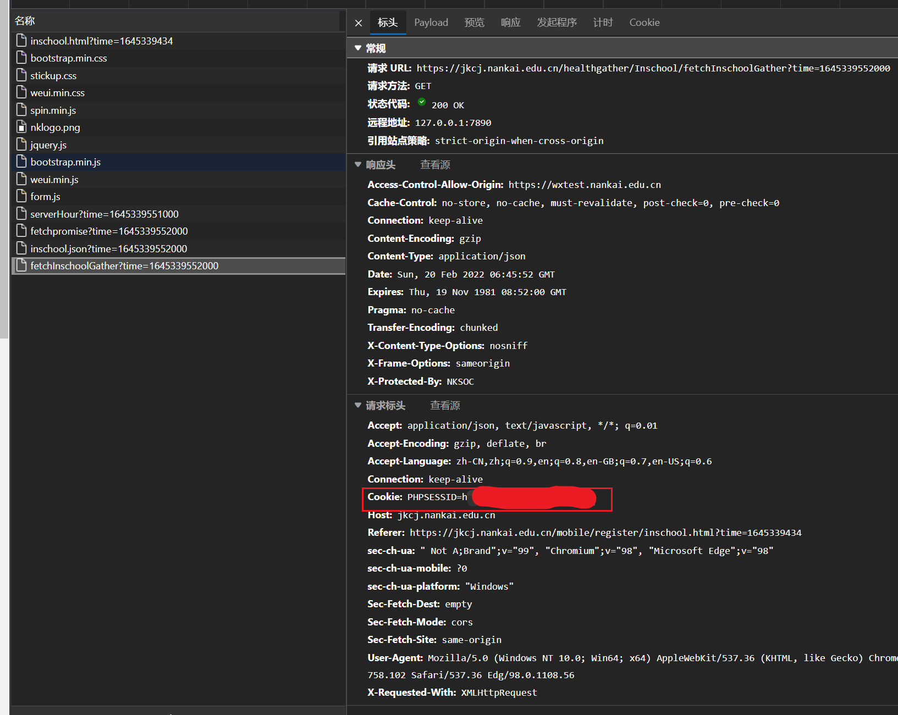
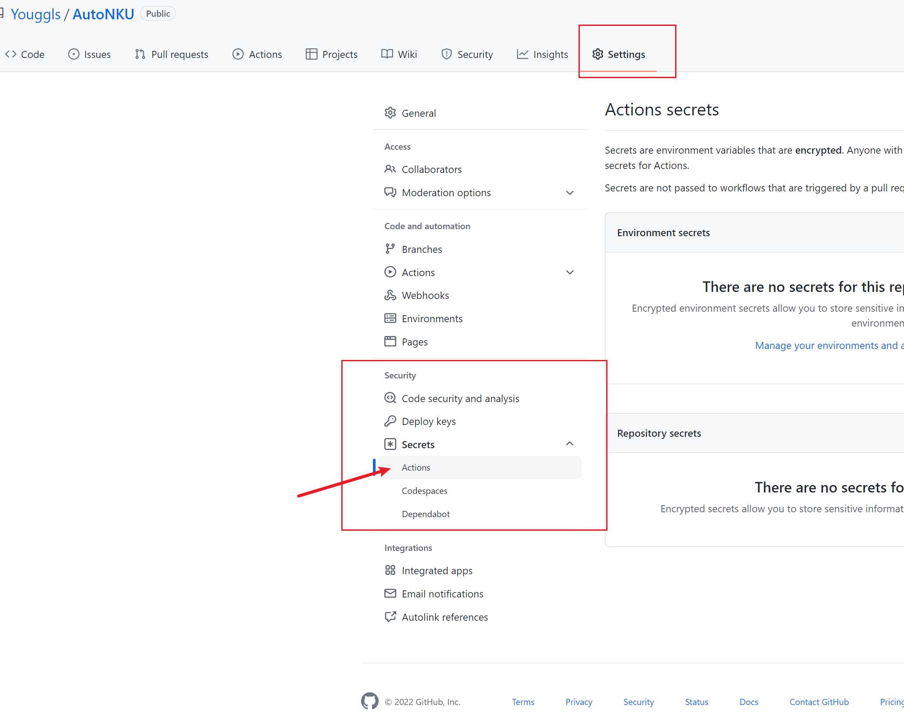
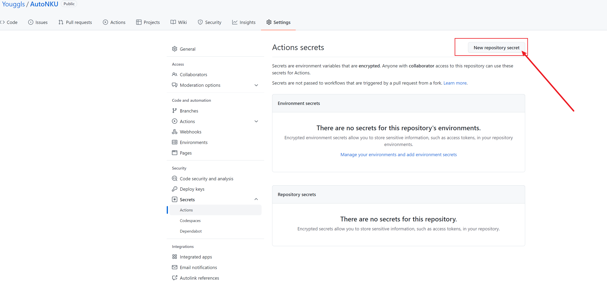

# AutoNKU

> 南开大学飞书自动防疫信息填报程序，默认每天早上 11 点自动填报
> 
> **非在校生请勿使用，目前该程序存在问题不能正常使用**
## 使用前必读

本程序旨在简化同学们的填报程序，为没有异常情况的同学简化日常生活。如果您有**以下任意一项情况**，请勿使用本程序：

1. 体温异常（大于 37.3 摄氏度）
2. 14 天内有过疫情中高风险地区出入史
3. 使用者当前在中高风险地区
4. 近14天是否与确诊/疑似/无症状感染/密切接触者等密切接触的
5. 近14天共同生活的家庭成员中，存在中高风险地区旅居史、高风险场所暴露史、高危人群和物品接触史的人员
6. 近14天有境外旅居史
7. 近14天内出现发热或呼吸道症状
8. 健康码或行程码非绿色或带有星号
9. 有着其他可能造成疫情传播风险的行为或情况
10. 有着其他可能违反国家或地方疫情防控规定的行为或情况

使用本程序表明您已悉知以上条约，以及对使用本程序带来的一切潜在后果均由自己负责。

另外，请勿使用该程序进行商业性质盈利，使用该程序表明您遵守 GPL v3 开源协议。

## 如何配置

### Fork 本仓库

1. 点击本仓库主页面，右上角的 `fork` 按钮。

### 获取 Cookie

1. 在 PC 安装飞书，不出意外你的消息中心里应该有很多提醒你填报的通知

2. 点开任意一个，在浏览器授权进入填报界面

3. 不要管浏览器的提醒，按 `F12`，打开开发者工具栏

4. 点击 `网络` 这一个标签，有的浏览器没有中文，可能是 `Network`，根据自己的实际情况来

5. 如果这里没有记录到的请求请按 `CTRL+R` 或 `F5` 刷新页面

6. 现在可以看到有很多网络请求，我们点开最下边的

7. 可以看到标头内有一个 `请求标头` 或者是 `Request Headers`，里边有一项是 `Cookie: PHPSESSID=xxxxx`，把等号后的东西复制出来，就是我们上边要填的 Cookie

### 配置 Secrets key

> Secrets key 中配置的任何东西都是你本人才能看的（或者是仓库的开发者），fork 过去之后其他人是看不到的（包括我），**不用担心隐私泄露**

1. 依次点击 `Settings` -> `Secrets` -> `Actions`
    

2. 点击 `New repository secret` 按钮

   

3. 分别在 Name，Value 框内填入以下内容（**在校生版**，非在校生情看 4）

   | Name      | Value                                   |
   | --------- | --------------------------------------- |
   | PHPSESSID | 浏览器内看到的 Cookie（如何获取详见：获取 Cookie 部分） |
   | q14       | 你个人手机号                            |
   | q15       | 家庭住址                                |
   
4. 分别在 Name，Value 框内填入以下内容（**非在校生**版，开发中）

    | Name      | Value                                                        |
    | --------- | ------------------------------------------------------------ |
    | PHPSESSID | 浏览器内看到的 Cookie（如何获取详见：获取 Cookie 部分）      |
    | q9        | 现所在地具体地址 （在校生默认为'宿舍'，其他同学请填写详细地址） |
    | q21       | 现所在地街道/村                                              |
    | q14       | 你个人手机号                                                 |
    | q15       | 家庭住址                                                     |

### 配置 data.json

data.json 内的每个字段详见 `字段含义`，你可以把你觉得敏感的信息按照 q14 q15 一样设置为 null。然后通过 secret key 来填写保护隐私。

其中需要特别说明的是 q10_show 和 q10 两项内容，为你当前所在地的信息。

`q10_show` 字段请严格填写 `xx省/xx市/xx（县/市/区）`，或者是 `xx市/xx市/xx区` 格式，如果不确定可以去飞书看一眼

`q10` 字段需要填写省市 id，这个是和该地身份证前六位对应的，对于直辖市，一般是 3+3 组合（直辖市号码+区号码），对于普通省市，一般是 2+2+2（省号码+地级市号码+县号码），可以上百度查询。

以天津市津南区为例，`q10_show` 应填写为 `天津市/天津市/津南区` ，对应的号码是 120+112，`q10` 填写方式是 `120000/120000/120112`

以山东省潍坊市昌乐县为例，`q10_show` 应填写为 `山东省/潍坊市/昌乐县` ， 对应的号码是 37+07+25，`q10` 填写方式是 `370000/370700/370725`

## 字段含义

### 在校生版

|   key    |                             含义                             |
| :------: | :----------------------------------------------------------: |
|    q1    |                       1. 昨日晚上体温                        |
|   q16    |                       2. 今天早上体温                        |
|   q17    |                       3. 今天中午体温                        |
|    q2    |                         4. 现所在地                          |
| q10_show |                 5. 现所在地区（精确到区县）                  |
|   q10    |        5. 上一项对应的省市县id，格式为 省id/市id/县id        |
|    q9    |          6. 现所在地具体地址 （在校生默认为'宿舍'）          |
|   q14    |                 7. 联系电话（请填写手机号）                  |
|   q15    |                         8. 家庭住址                          |
|    q4    | 9. 近14天是否有疫情中高风险地区出入史，默认为字符 'N'，如有其他特殊情况请手动填写 |
|    q5    | 10. 近14天是否与确诊/疑似/无症状感染/密切接触者等密切接触的，默认为字符 'N'，如有其他特殊情况请手动填写 |
|   q20    | 11. 近14天共同生活的家庭成员中，是否存在中高风险地区旅居史、高风险场所暴露史、高危人群和物品接触史的人员 ，默认为字符 'N'，如有其他特殊情况请手动填写 |
|   q11    | 12. 近14天是否有境外旅居史，默认为字符 'N'，如有其他特殊情况请手动填写 |
|   q12    | 13.近14天内是否出现发热或呼吸道症状？默认为字符 'N'，如有其他特殊情况请手动填写 |
|   q13    |     14.今日健康码情况。可选值：'green', 'orange', 'red'      |
|   q22    | 15.今日行程码情况。可选值：'green', 'orange', 'yellow', 'red' |
|   q24    | 16.行程卡是否有星号？默认为字符 'N'，如有其他特殊情况请手动填写 |
|   q23    | 17.过去的24小时内，是否离开过天津？数字 2 表示否，数字 1 表示是，如有是请勿使用本程序 |
|   q18    |       18.宿舍昨天是否通风？默认 3，表示通风两次及以上        |
|   q19    |           19.宿舍昨天是否消毒？默认 2，表示已消毒            |
|    q8    |              20.其他事项反馈（非必填）默认为空               |

### 非在校生版

|   key    |                             含义                             |
| :------: | :----------------------------------------------------------: |
|    q1    |                       1. 今日晚上体温                        |
|    q2    |                         2. 现所在地                          |
| q10_show |                 3. 现所在地区（精确到区县）                  |
|   q10    |         3. q3 对应的省市县id，格式为 省id/市id/县id          |
|   q21    |                      4. 现所在地街道/村                      |
|    q9    | 5. 现所在地具体地址 （在校生默认为'宿舍'，其他同学请填写详细地址） |
|   q14    |                 6. 联系电话（请填写手机号）                  |
|   q15    |                         7. 家庭住址                          |
|    q4    | 8. 近14天是否有疫情中高风险地区出入史，默认为字符 'N'，如有其他特殊情况请手动填写 |
|    q5    | 9. 近14天是否与确诊/疑似/无症状感染/密切接触者等密切接触的，默认为字符 'N'，如有其他特殊情况请手动填写 |
|   q20    | 10. 近14天共同生活的家庭成员中，是否存在中高风险地区旅居史、高风险场所暴露史、高危人群和物品接触史的人员 ，默认为字符 'N'，如有其他特殊情况请手动填写 |
|   q11    | 11. 近14天是否有境外旅居史，默认为字符 'N'，如有其他特殊情况请手动填写 |
|   q12    | 12.近14天内是否出现发热或呼吸道症状？默认为字符 'N'，如有其他特殊情况请手动填写 |
|   q13    |     13. 今日健康码情况。可选值：'green', 'orange', 'red'     |
|   q22    | 14.今日行程码情况。可选值：'green', 'orange', 'yellow', 'red' |
|   q24    | 15.行程卡是否有星号？默认为字符 'N'，如有其他特殊情况请手动填写 |
|   q23    | 16. 过去的24小时内，是否离开过天津？数字 2 表示否，数字 1 表示是，如有是请勿使用本程序 |
|   q16    |        17. 能否正常到校（正常到校为 1，暂缓到校为 0）        |
|   q17    |     17. 能否正常到校 - 预计到校日期（格式为 2022/03/02）     |
|   q19    | 17. 能否正常到校报到 - 预计到校方式：1 代表东站（天津站），2 代表西站，3 代表南站，4 代表机场，5 代表自驾，6 代表其他 |
|    q8    |              18. 其他事项反馈（非必填）默认为空              |

## 隐私保护

可以看到请求体相关信息通过仓库内 json 文件配置给出，您可以通过将仓库设置为私有来保护您的相关隐私。也可以通过 secret key 来部署相关敏感字段。

具体操作流程如下：

1. 设置相关字段为 null，例如你认为 `q1` 字段对应的体温是敏感信息，你可以设置 `q1` 对应的值为 null（不加引号）。
2. 参考前边提到的 Secret key 部分，将你认为需要设置的字段和值填入其中
3. 修改 `./github/workflows/blank.yml` 文件中的最后，与最后一行对齐，以 q1 为例，填入 `q1: ${{secrets.q1}}` （可以换成其他）。
